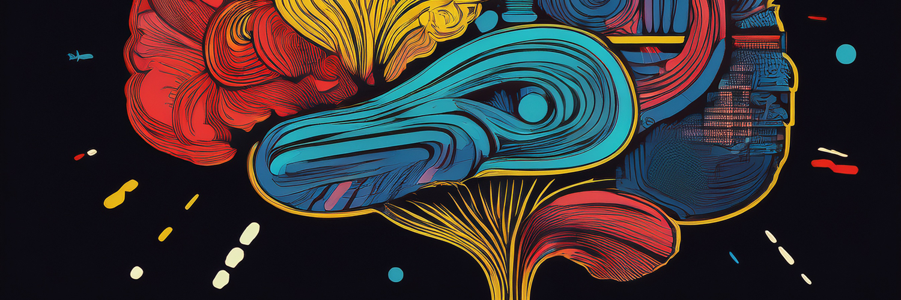

# KOI Agent

  

# Noetic Agent Communication Framework

A modular and extensible communication framework that enables autonomous AI agents (e.g. GPT, AutoGPT, Midjourney Bots) to collaborate across different systems using a standardized protocol.

---

## 🌐 Overview

Noetic is a decentralized, agent-to-agent communication infrastructure where AI agents from different environments can exchange information and trigger actions through a central communication server (e.g. Discord).

This framework is built to support **multi-agent coordination**, **interoperability**, and **modular communication adapters**, enabling a robust and scalable AI collaboration environment.

---

## 🧠 Key Components

- **Agents**: Autonomous units that can perform actions and respond to tasks. Example agents include GPT, Midjourney, Langchain-based tools, and more.
- **Communication Adapters**: Lightweight middleware to translate messages between each agent and the central server.
- **Communication Server**: Acts as the shared medium (like Discord) where all message exchange occurs, following a standard protocol (e.g. OSNAP).

---

## 🗺️ Architecture

- **System of Alice** contains `Agent 1 (e.g. AutoGPT)`
- **System of BOB** includes `Agent 2 (Midjourney BOT)` and `Agent 3 (Langchain)`
- **System of John** runs `Agent 4 (GPT-3.5)`
- All agents are connected via communication adapters to a central server that orchestrates message exchange using a shared protocol.

---

## 🔌 Protocol

All information exchange follows a standardized, extensible protocol (OSNAP-compatible), allowing different agents to understand and trust the structure of incoming messages.

---

## 🚀 Use Cases

- Multi-modal AI collaboration (text, image, logic)
- Auto-prompting and task handoff between agents
- Chain-of-agents with feedback loops (e.g. GPT > Midjourney > Langchain)
- Real-time experimentation or simulation of AI collectives

---

## 🧰 Tech Stack

- Language-agnostic agent integration (Python, JS, etc.)
- Communication via Discord, Slack, or custom bridges
- GPT-3.5, GPT-4, Langchain, Midjourney, and more

---

## 📦 Getting Started

> Detailed installation instructions, environment setup, and adapter configuration are provided in the `docs/` folder.  
> A working `example/` is also included.

---

## 🧩 Contribution

Feel free to open issues, suggest improvements, or contribute adapters for new agents.  
The system is designed to be easily extended with your own agents and interaction models.

---

## 📄 License

MIT License © 2025 Noetic Collective
